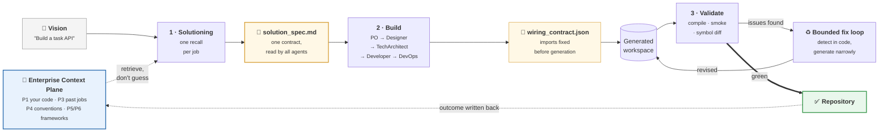

# OPL Crew Mono

AI-powered software development platform. Multi-agent crew (MetaAgent, ProductOwner, TechArchitect, Developer, DevOps) generates complete application projects from a natural language description.

It is built for **sovereign deployment**: self-hosted models on your own
infrastructure, where a 14b-class model is the realistic ceiling. That single
constraint explains most of the design below — when the model is small, the
platform has to supply the knowledge and do the reasoning it cannot.

## Documentation

- **[System architecture](docs/architecture.md)** — how the services interact, the job lifecycle, data stores, and the six knowledge planes. Start here.
- [Context memory plane](docs/context-memory-plane.md) — cross-job memory (P3): setup, scope model, and operations.

---

## How it works

A job goes from one sentence to a validated repository in three stages.
**Retrieval happens once, up front**, and everything downstream reads a single
contract rather than querying for itself.



Three properties are worth calling out, because they are what make a small
model viable:

1. **Retrieval is isolated from generation.** The solutioning stage queries the
   context plane once and writes `solution_spec.md`. The build agents read that
   file; they never query the planes themselves. One recall per job instead of
   one per agent, and one artefact to review when the output is wrong.
2. **The wiring contract goes first.** Import paths, module roots, and public
   symbols are decided *before* any code is written, so the model is told what
   to import instead of inventing it.
3. **Deterministic detection, narrow generation.** Anything derivable from code
   is taken from code — compiler output, static symbol diffs, exit codes. The
   model is asked only to type the fix. A 14b's reasoning is the scarcest
   resource in the system, so the harness spends it as rarely as possible.

The feedback arrow matters too: a finished job writes its outcome back into P3,
so the next job starts with what this one learned.

---

## What is the Enterprise Context Plane?

**A shared retrieval layer that answers questions about *your* organisation —
its code, conventions, history, and frameworks — so agents look facts up
instead of recalling them from model weights.**

It is the difference between an agent that guesses how your team writes a
service and one that reads how your team writes a service.

Six planes, each answering a question no other can:

| Plane | Source | Question it answers | Status |
|---|---|---|---|
| **P1** structural | llm-tldr on your workspace | What exists? Who calls what? What breaks if I change X? | ✅ Built |
| **P2** domain | Hyper-Extract MCP | What are the business entities and rules in our docs? | Planned |
| **P3** historical | MemMachine | What did we decide before? What failed review? | ✅ Built |
| **P4** normative | skills-service | How does our org expect code to be written? | ✅ Built |
| **P5** framework API | Context7 MCP | What is the exact annotation for this framework version? | Deferred |
| **P6** framework internals | llm-tldr on framework source → Neo4j | How does the framework actually behave inside? | Planned |

### Why it matters

**A model cannot know your codebase.** No amount of parameter scale puts your
internal conventions, your past architectural decisions, or last quarter's
review comments into the weights. For organisation-specific facts, retrieval
beats scale — which is precisely why a 14b with a good context plane can
outperform a much larger model without one.

**It is what makes sovereignty affordable.** Self-hosting caps you at small
models. The context plane is how that cap stops being a quality ceiling: the
platform supplies the knowledge, so the model only has to write code.

**Knowledge compounds instead of evaporating.** Every finished job writes its
outcome back to P3. Job 50 starts with what jobs 1–49 learned. Without this,
each job re-derives the same context and pays the same tokens to reach the same
conclusions.

**Governance becomes reviewable.** Conventions live in skills-service as
documents in Git — architects decide which patterns agents may apply, and
changes go through review. The alternative is convention-as-prompt-folklore,
enforced inconsistently in each developer's editor and auditable nowhere.

**Cost control.** Retrieved context is cheaper than re-derived context, and far
cheaper than the iterations wasted when an agent guesses wrong and the fix loop
has to unwind it.

> Full detail, including how each plane reaches the agents:
> [docs/architecture.md § The six knowledge planes](docs/architecture.md).

---

## Services

| Service | Description | Port |
|---------|-------------|------|
| **Backend** | FastAPI ASGI + AI Agents | 8080 |
| **Frontend** | React + PatternFly UI | 3000 |
| **Validator** | Code validation microservice | 8181 |
| **Skills** | Semantic skill search _(optional)_ | 8090 |
| **Jira** | Atlassian Jira Server _(optional)_ | 8081 |
| **Connector** | Jira-to-Crew webhook bridge _(optional)_ | 8082 |
| **Keycloak** | OIDC identity provider | 8180 |
| **Skill Manager** | Skills marketplace _(profile: skills)_ | 8091 |
| **MemMachine** | Context memory plane, P3 _(profile: memory)_ | 8280 |
| **MemMachine Postgres** | pgvector — profile/semantic memory _(profile: memory)_ | 55432 |
| **MemMachine Neo4j** | Episodic graph memory _(profile: memory)_ | 7474 / 7687 |
| **headroom** | Token-compression proxy _(profile: headroom)_ | 8787 |
| **Sandbox API** | Runs generated code in containers — **runs on the host**, not compose | 18080 |

See [docs/architecture.md](docs/architecture.md) for how these interact.

---

## Production Install

### Option A — One-line install (no git clone needed)

Requires: `curl`, `podman ≥ 4.0`

```bash
curl -fsSL https://raw.githubusercontent.com/varkrish/opl-crew-mono/main/installer.sh | bash
```

Or download and run locally:

```bash
curl -fsSL https://raw.githubusercontent.com/varkrish/opl-crew-mono/main/installer.sh -o installer.sh
chmod +x installer.sh
./installer.sh
```

The installer will:
1. Download `compose.yml` from this repo
2. Write `~/.crew-ai/config.yaml` (permissions `600`) and a local `.env`
3. Pull all pre-built images from `quay.io`
4. Start the stack and open `http://localhost:3000`

**It asks nothing.** The installer is fully non-interactive — no LLM API key,
no model choices, no prompts at all. Credentials are **BYOK**: after the stack
is up, each user adds their own key in the UI under **Settings → API
Configuration**, where it is encrypted per user. Jobs stay pending until a key
is saved.

That is a deliberate credential model, not a convenience: a key collected once
at install time is a key every user of that instance shares, with no way to
attribute spend or revoke one person's access.

**Optional server fallback.** If you want a shared key for users who have not
added their own, supply it through the environment — never a prompt:

```bash
LLM_API_KEY=sk-... ./installer.sh
```

| Variable | Default |
|----------|---------|
| `LLM_API_KEY` | _(empty — and empty is a supported state)_ |
| `LLM_API_BASE_URL` | `https://litellm-prod.apps.maas.redhatworkshops.io` |
| `LLM_MODEL_MANAGER` | `deepseek-r1-distill-qwen-14b` |
| `LLM_MODEL_WORKER` | `qwen3-14b` |
| `LLM_MODEL_REVIEWER` | `qwen3-14b` |

Precedence is environment → existing `.env` → built-in default, so re-running
the installer never clobbers settings you already have.

**Installer flags:**

```bash
./installer.sh --force  # re-pull images even if already present
./installer.sh --yes    # accepted for compatibility; nothing to skip
./installer.sh --help
```

**Update to latest images:**

```bash
./installer.sh --force --yes
```

> Works on **macOS** (bash 3.2+) and **Linux** (Fedora, Ubuntu, RHEL).  
> Pipe-install (`curl | bash`) and unattended CI runs take the identical path,
> since there is nothing to prompt for.

---

### Option B — Manual setup from clone

```bash
git clone --recurse-submodules https://github.com/varkrish/opl-crew-mono.git
cd opl-crew-mono
```

Copy the environment file:

```bash
cp .env.example .env
```

Write backend config (adjust models as needed):

```bash
mkdir -p ~/.crew-ai && chmod 700 ~/.crew-ai
cat > ~/.crew-ai/config.yaml <<'EOF'
llm:
  # Optional server fallback only. Leave empty and add your key in the UI
  # under Settings → API Configuration, where it is encrypted per user.
  api_key: ""
  api_base_url: "https://litellm-prod.apps.maas.redhatworkshops.io"
  environment: "production"
  model_manager: "deepseek-r1-distill-qwen-14b"
  model_worker: "qwen3-14b"
  model_reviewer: "qwen3-14b"
  max_tokens: 8192
  temperature: 0.7
budget:
  max_cost_per_project: 100.0
EOF
chmod 600 ~/.crew-ai/config.yaml
```

Add to `.env`:

```env
CONFIG_FILE=~/.crew-ai/config.yaml
AUTH_ENABLED=false
HF_HOME=/tmp/hf
```

Start the stack:

```bash
podman compose -f compose.yml up -d validator backend frontend
```

---

## Development Setup

Source-mounted services with hot-reload:

```bash
# Core stack (backend + frontend + validator)
podman compose -f dev-compose.yml up -d

# Add skills service
podman compose -f dev-compose.yml --profile skills up -d

# Add Jira + connector
podman compose -f dev-compose.yml --profile jira up -d

# All optional profiles
COMPOSE_PROFILES=skills,jira podman compose -f dev-compose.yml up -d
```

---

## Authentication

### No-auth mode (demo / dev)

```env
AUTH_ENABLED=false
```

When disabled, services bypass OIDC and use mock credentials automatically.

### Keycloak / OIDC

The stack includes Keycloak with a pre-seeded `opl-crew` realm. For external OIDC providers:

| Variable | Where | Purpose |
|----------|-------|---------|
| `VITE_OIDC_AUTHORITY` | Frontend | Identity provider authority URL |
| `VITE_OIDC_CLIENT_ID` | Frontend | Public client ID (default: `opl-studio`) |
| `KEYCLOAK_ISSUER_URL` | Backend | Issuer URL for JWT verification |
| `KEYCLOAK_JWKS_URL` | Backend | JWKS cert endpoint |

---

## Service Health

```bash
curl localhost:8080/health    # Backend
curl localhost:8181/healthz   # Validator
curl localhost:3000/          # Frontend
```

---

## Common Commands

```bash
# Submit a test job (auth disabled)
curl -X POST http://localhost:8080/api/jobs \
  -H "Content-Type: application/json" \
  -d '{"vision": "Build a simple calculator API"}'

# Follow backend logs
podman logs -f crew-backend

# Restart a single service
podman compose -f compose.yml restart backend

# Stop everything
podman compose -f compose.yml down

# Stop and remove volumes (full reset)
podman compose -f compose.yml down -v
```

---

## Compose Files

| File | Purpose |
|------|---------|
| `compose.yml` | **Production** — all pre-built images, no local build |
| `dev-compose.yml` | **Development** — source-mounted, hot-reload, optional profiles |

---

## Submodules

| Directory | Repository |
|-----------|------------|
| `opl-ai-software-team` | [varkrish/opl-ai-software-team](https://github.com/varkrish/opl-ai-software-team) |
| `opl-studio-ui` | [varkrish/opl-studio-ui](https://github.com/varkrish/opl-studio-ui) |
| `crew-code-validator` | [varkrish/crew-code-validator](https://github.com/varkrish/crew-code-validator) |
| `crew_jira_connector` | [varkrish/crew_jira_connector](https://github.com/varkrish/crew_jira_connector) |
| `skills-service` | [varkrish/skills-service](https://github.com/varkrish/skills-service) |

Update all submodules to latest:

```bash
git submodule update --remote --merge
```

---

## UI Settings

Configure workflow behaviour from the Studio UI (Settings menu):

| Tab | What it configures |
|-----|--------------------|
| **Workflow** | Plan review gate, solutioning loop, auto-approve |
| **GitHub** | PAT for solutioning research |
| **API Configuration** | Per-user LLM provider and models |
| **Jira** | Jira credentials for issue integration |

---

## OPL CLI

The `opl-cli` provides terminal access to manage environments, authenticate, and configure backend settings.

### 1. Authentication
The CLI supports browser-based OAuth redirect login against Keycloak:
```bash
./opl-cli-bin auth login
```
This spins up a local listener on port `8080` and opens your browser. Upon successful authentication, the token is automatically captured and saved to your active CLI environment.

### 2. Environment Management
Point the CLI to different backend instances:
```bash
./opl-cli-bin env add local --url http://localhost:8080
./opl-cli-bin env use local
./opl-cli-bin env list
```

### 3. Settings Management
You can view and modify all configuration settings directly via the CLI:
```bash
# View configuration as JSON
./opl-cli-bin settings workflow get
./opl-cli-bin settings llm get
./opl-cli-bin settings jira get
./opl-cli-bin settings github get
./opl-cli-bin settings mcp list

# Securely set LLM keys (prompts for API key via stdin to keep it out of bash history)
./opl-cli-bin settings llm set --api-base-url "https://api.openai.com/v1" --model-worker "gpt-4o"
```
